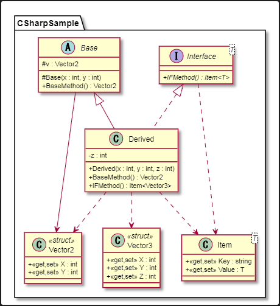

# ClassDiagramGenerator

This is a tool to generate a class diagram written in PlantUML from source codes.

## Usage

```
ClassDiagramGenerator.exe -i <input_path> -o <output_path> -l <language> -al <access_level> -ec <excluded_class>
```

* \<input_path\> **[Required]**
    * Input directory path including source codes.
* \<output_path\> **[Required]**
    * Output file path.
* \<language\> **[Required]**
    * Programming language. Supported languages are as follows.
        * Java : "java"
        * C# : "cs" or "csharp"
* \<access_level\> **[Optional]**
    * Access levels of members displayed in a diagram.
    * Default is all access levels.
    * Use ',' as separator to specify multiple access levels.
* \<excluded_class\> **[Optional]**
    * Excluded class names, which is not displayed in a diagram.
    * Use ',' as separator to specify multiple access levels.

## Specification

* All classes included in the input directory are written in PlantUML.
    * Excluded members and classes are written as comment text.
* Relations between classes included in the input directory are written.
    * Dependency
    * Association
    * Generalization
    * Realization
    * Nested class
* This tool does not support applying to source codes that cannot be compiled.
* Limitations
    * Classes that have the same name and different type parameters cannot be written correctly.
        * All of them are written, but only one of them is displayed in a diagram.
	* Multidimensional arrays in C# (such as int[,]) are written as jagged arrays.
		* ex) int[,] -> int[][]

## Examples

* Source code

```
namespace CSharpSample
{
	public struct Vector2
	{
		public int X { get; set; }
		public int Y { get; set; }
	}

	public struct Vector3
	{
		public int X { get; set; }
		public int Y { get; set; }
		public int Z { get; set; }
	}

	public class Item<T>
	{
		public string Key { get; set; }

		public T Value { get; set; }
	}

	public abstract class Base
	{
		protected Vector2 v;

		protected Base(int x, int y) { }

		public virtual Vector2 BaseMethod() { return default(Vector2); }
	}

	public interface Interface<T>
	{
		Item<T> IFMethod();
	}

	class Derived : Base, Interface<Vector3>
	{
		private int z;

		public Derived(int x, int y, int z) : base(x, y) { }

		public override Vector2 BaseMethod() { return default(Vector2); }

		public Item<Vector3> IFMethod() { return null; }
	}
}
```

--------

* Class diagram




## License

MIT
